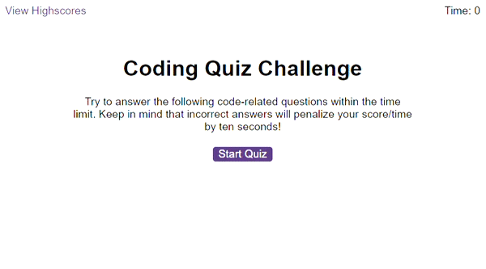

# Javascript Code Quiz

## Description

This week's challenge was to create a code quiz using javascript.

Visit the deployed page [here](https://github.com/YaszMoon/FEWDB-week06-JS-Code-Quiz).

## User Story

**AS A** coding boot camp student
**I WANT** to take a timed quiz on JavaScript fundamentals that stores high scores
**SO THAT** I can gauge my progress compared to my peers

## Acceptance Criteria

**GIVEN** I am taking a code quiz

**WHEN** I click the start button

**THEN** a timer starts and I am presented with a question

**WHEN** I answer a question

**THEN** I am presented with another question

**WHEN** I answer a question incorrectly

**THEN** time is subtracted from the clock

**WHEN** all questions are answered or the timer reaches 0

**THEN** the game is over

**WHEN** the game is over

**THEN** I can save my initials and score

## Limitations

There were some .wav files included in the starter files. I attempted to add them to an event listener so that when a correct or incorect answer is selected the respective sound would play. I was unable to make this work correctly.

Also, while I was able to store the users initials and score in local storage so as to populate the highscores page, I was unable to do this in such a way that every run of the quiz would result in a new entry.

## Visuals

